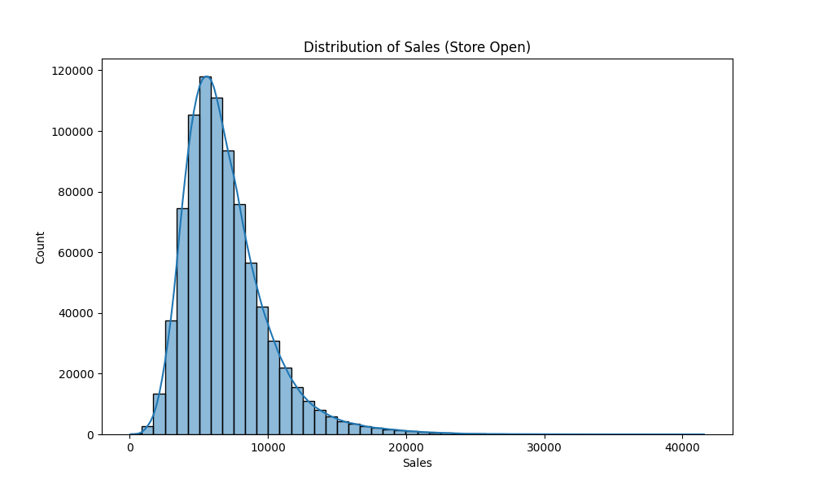
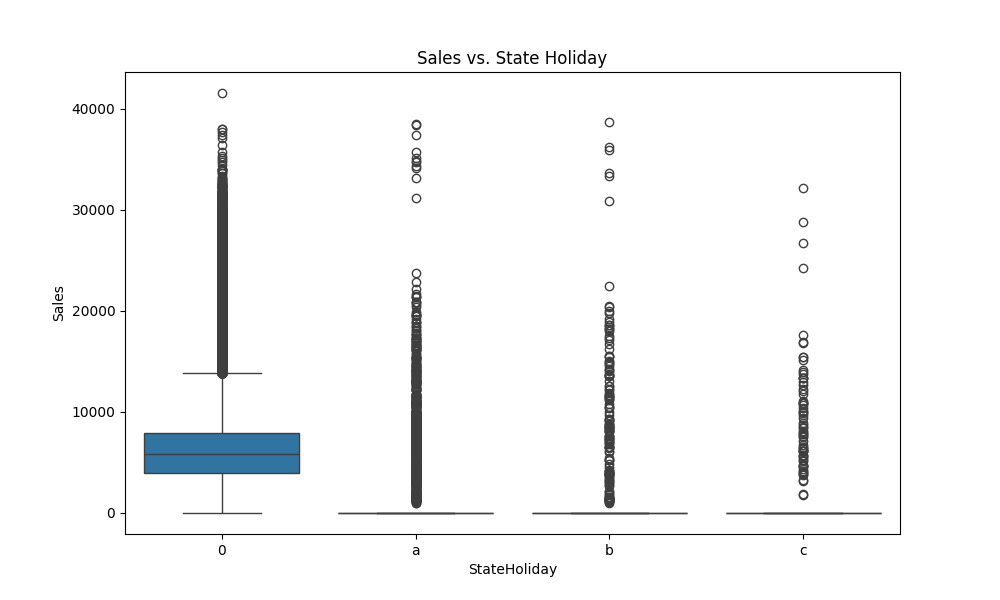

# Keşifsel Veri Analizi (EDA) Raporu

Bu rapor, Rossmann mağaza satışları veri seti üzerinde yapılan keşifsel veri analizinin sonuçlarını özetlemektedir.

## 1. Veri Seti Genel Bakış

Veri seti, Rossmann mağazalarının tarihsel satış verilerini içermektedir.
- **Toplam Gözlem Sayısı:** 1,017,209
- **Toplam Özellik Sayısı:** 18

### Temel İstatistikler (Satışlar)
- **Ortalama Satış:** 5,773.82
- **Standart Sapma:** 3,849.93
- **Maksimum Satış:** 41,551
- **Medyan Satış:** 5,744

## 2. Kayıp Veri Analizi

Aşağıdaki özelliklerde eksik veriler tespit edilmiştir:
- **Promo2SinceYear / Promo2SinceWeek / PromoInterval:** ~%50 (Bu mağazaların Promo2 kampanyasına katılmadığını gösterir)
- **CompetitionOpenSinceMonth / CompetitionOpenSinceYear:** ~%32
- **CompetitionDistance:** ~%0.26

Eksik veriler, uygun stratejilerle (örneğin, medyan atama veya '0' ile doldurma) işlenmiştir.

## 3. Satışların Dağılımı

Mağazaların açık olduğu günlerdeki satış dağılımı aşağıda gösterilmiştir. Dağılımın sağa çarpık (right-skewed) olduğu görülmektedir, bu da çoğu gün ortalama satış yapılırken, bazı günlerde (muhtemelen promosyon veya tatil dönemleri) çok yüksek satışlar gerçekleştiğini gösterir.

## 4. Tatil Günlerinin Etkisi

Resmi tatillerin (StateHoliday) satışlar üzerindeki etkisi incelenmiştir. Tatil günlerinde mağazaların çoğu kapalı olsa da, açık olan veya tatil öncesi/sonrası dönemlerde satış davranışları farklılık göstermektedir.

