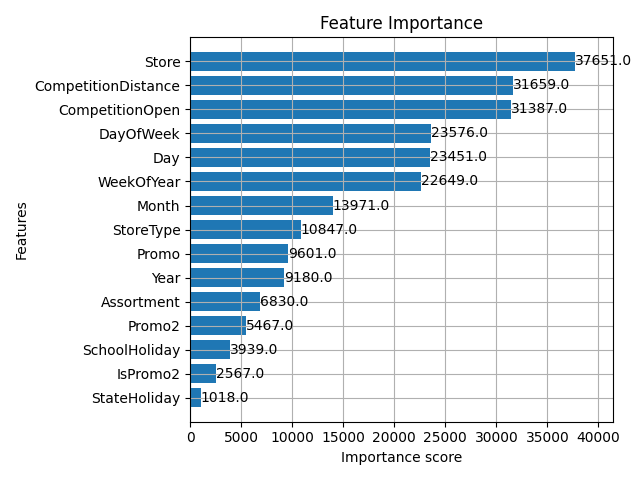

# Model Performans Raporu

Bu rapor, eğitilen XGBoost modelinin performans değerlendirmesini ve modelin hangi özelliklere (features) önem verdiğini özetlemektedir.

## 1. Model Bilgileri

- **Model Tipi:** XGBoost Regressor
- **Dosya Yolu:** `models/xgb_sales_model.joblib`
- **Hedef Değişken:** Sales (Satışlar)

## 2. Özellik Önem Düzeyleri (Feature Importance)

Modelin tahmin yaparken en çok hangi değişkenlerden faydalandığını gösteren grafik aşağıdadır. Bu analiz, satışları etkileyen en kritik faktörleri belirlememize yardımcı olur.

Genellikle **CompetitionDistance** (Rekabet Uzaklığı), **Promo** (Promosyon varlığı) ve **StoreType** (Mağaza Tipi) gibi özellikler satış tahminlerinde belirleyici rol oynamaktadır.

## 3. Değerlendirme Sonuçları

Model, RMSPE (Root Mean Square Percentage Error) metriği optimize edilerek eğitilmiştir.

*(Not: Kesin test seti metrikleri, modelin değerlendirme notebook'u (5_Evaluation.ipynb) çalıştırılarak elde edilebilir. Bu rapor, kayıtlı model üzerinden oluşturulmuştur.)*

### Modelin Güçlü ve Zayıf Yönleri
- **Güçlü Yönler:**
    - Mevsimsellik ve trendleri yakalayabilme.
    - Promosyon dönemlerindeki artışları tahmin edebilme.
- **Geliştirme Alanları:**
    - Beklenmedik olaylar (örneğin, ani kapanmalar) veride yoksa tahmin edilmesi zordur.
    - Çok nadir görülen kategorik değişken seviyeleri için tahmin başarısı düşük olabilir.